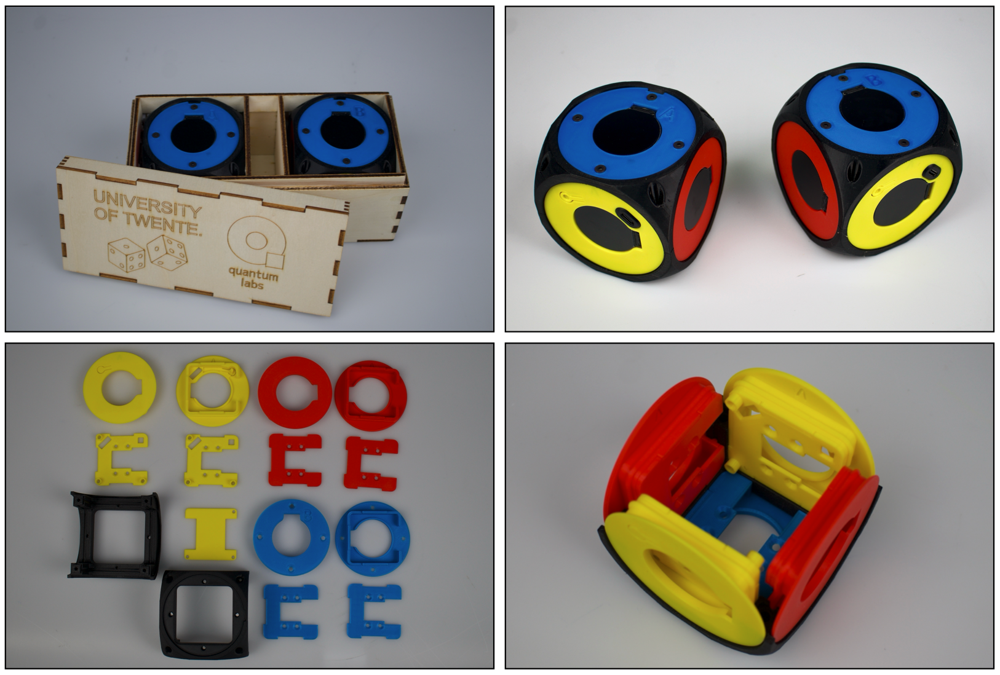

# Quantum Dice parts sourcing and assembly Manual

## 1. Introduction

This construction manual contains all information to build your own set of Quantum Dices. It includes the sourcing of components, 3D printing and the Assembly instructions.

The Quantum Dice is developed by the University of Twente. All designs are freely available under the MIT licence.

For further information goto [Quantum Dice by University of Twente](ut.onl/quantumdice)

> :memo: The University of Twente provides the ready-to-use electronic boards. Other components, such as 3D-printed parts, displays, and batteries, need to be obtained independently.

## 2. General description of the Quantum Dice

The Quantum Dices serves the purpose to grasp Quantum mechanical terms like Quantum Superposition, Entanglemetn and Quantum Key Distribution.

The Quantum Dices are used in pairs. One is assigned as role A and the other one as role B. The software is identical for both roles as are the 3D printed parts. Except for the top (blue) Display cup where an A respectively a B is marked.

The Quantum Dices are made of 3D printed frame with electronic displays on each of the six sides. The displays are controlled with a microprocessor unit (MCU), in this case an ESP32-S3 module with an orientation sensor and a random generator. The dice is battery powered.

The base of the Quantum Dice is a black frame in which on all six sides electronic TFT displays are mounted. The display fit into so called Display Cups of different colors, depending on the axis of the dice:

- front/rear, x-axis, yellow
- top/botton, z-axis, blue
- left/right, y-axis, red

The displays are controlled with a microprocessor unit (MCU), in this case an ESP32-S3 module.

The ESP32 module is soldered onto a Printed Circuit Board (PCB), (hereafter called ProcessorPCB) together with connectors to wire the displays, a Inertial Measurment Unit (IMU) to register the physical orientation and movement of the dice, a Cryptographic chip and a push button. This ProcessorPCB is mounted onto the rear display cup.

To power the system a second PCB (herafter called PowerPCB) is mounted onto the front display cup. This PCB provided power to the ProcessorPCB through a 4 wire cable. On the PowerPCB battery connector, power on-off button, a voltage regulator and a charging circuit with connector to USB-C charging connector. The battery voltage is monitored by the MCU.

When using in pairs, one dice is marked A (Alice) and the other one marked B (Bob). Because the software is idential, role A or role B is determined by the macAddress of the MCU as defined in the config file (see...).

## Sourcing of materials

The parts needed to construct the Quantum Dice are listed in the Bill of Material (BOM). The BOM can be found [BOM:](<parts list quantum dice.xlsx>). It's an Excell sheet with all parts and quantities are listed. In the top part you can enter the number of dices per role A or B you want to build and the total quantities are updated.

Currently 2 versions of the quantum dice are available:

- AllTPU: dice frame and display cups of TPU material (plaatje)
- TPUFrameOnly: dice frame from TPU with a bumper with the display cups of PLA (plaatje)

For the later version, only 1 color of TPU is needed (black) to print the frame. For the other components regular (and cheaper) PLA or PETG can be used.

It's also possible to print the AllTPU version in PLA or PETG. To reduce impact on the dice construction while rolling, you need to use a foam mattress (e.g. yoga mattress). The electronics and the software code are identical.

For a set you need an A and a B type. The dices are identical (including the firmware), except for the top of the dice where an A or B is indicated.

To demonstrate Quantum Teleportation a third dice is needed of type B.

### Sourcing electronic parts

#### PowerPCB and ProcessorPCB

The PowerPCB and ProcessorPCB can be sourced from the University of Twente: [Quantum Dice by University of Twente](ut.onl/quantumdice)

The ProcessorPCB is configured with the latest software, including IMU calibration and testing. The processorPCB are labeled with the macAddress (rear) and the role A or B it's assigned to.

A set of connection cables are included aswell a set of screws and bolds.

#### Displays and Battery

To obtain the TFT-Displays use the link in the BOM file.

Links to source the LIPO battery are also included in the BOM list. However, they are not always available. Alternative sources can be used.

Specification:

- 3.7V Lipo
- build in protection circuit (in the image above it hided under the black tape on top of the battery)
- capacity: > 1000 mAh
- size: maximum size 48mm high and 35 mm width. The thickness is often related to the capacity. 9--12 mm is ok.
- LIPO battery code: In the example the code 903048 is used. 9 mm thick, 30 mm wide and 48 mm high
- Connector: JST or JST-XH.

### Sourcing 3D printed parts

All 3D print files are in the STL format. The filename contains the color and material and a version number.

#### Selecting parts

With the provided Excel you can fill in the number of dices you need (A and B). The Excel calculates the needed 3D print files and the required electronics.

For convenience the plates with all required parts are created in 3MF file format. These files are generated using PrusaSlicer, but they can also be used in BambuStudio. Rearrangement of parts is needed.

#### 3D printing TPU

Printing TPU requires special attention. First the roll of material must be dryed before use to avoid stringing. Second the printing speed must be reduced to slow (add printing time), specifically with fast printing 3D printers like the Pruse Core One or the Bambulab. TPU cannot be used in the Bambu Lab's Automatic Material System (AMS) or Prusa MMU3 system because they push the material to the printing head. Because of the elasticity of TPU the material must be pulled into the printer head.

TPU is available in different hardnesses. 95A or 40D is ok.

Examples of TPU suppliers:

- [TPU 95A HF](https://eu.store.bambulab.com/products/tpu-95a-hf) Multiple color available.
- [Fiberlogy Fiberflex-40D:](https://www.3djake.nl/fiberlogy/fiberflex-40d) Limited colors. System preset is available for Prusa3D. Reduce print speed to ~60%

Additional information on how to print can be found here:
[Bambu lab](https://wiki.bambulab.com/en/knowledge-sharing/tpu-printing-guide?_gl=1*1nuoe8i*_up*MQ..*_ga*MTY3MTE2MTM2My4xNzQ1MzkwMzA4*_ga_WRST5SL6B3*MTc0NTM5MDMwNy4xLjAuMTc0NTM5MDMwNy4wLjAuMA..) On this Youtube the print settings are tweaked to get a better result: [How to improve TPU print quality on Bambu Lab X1 Carbon](https://youtu.be/yN3RximKNiE?si=DYWy9xm7ewkI_fWw)

It can be beneficial to outsource the printing job. Several companies can do this, also for TPU material. The price is largely determined by the printing method. Fused Deposition Modeling (FDM) is cheaper than Selective Laser Sintering (SLS). I have good experience with [JLC3D](https://jlc3dp.com/3d-printing/fused-deposition-modeling) with FDM. Quality is OK and not to expensive.

#### Display cups to hold the TFT displays

Cups to hold the TFT displays in 3 colors for the X, Y and Z-axis. The cups also needs a back plane that will be glued on the display cups. The back planes for the yellow cups (front and rear) are different from the others. They are designed to mount the Power and ESP32 Printed Circuit Boards (PCB). To mount the battery an additional back plane is required. No support is needed for the printing

#### Upper and Lower frame part in black

The frames parts are printed with the flat side onto the print plate. Support is needed.

## Printing and assembly 3D printed parts

### Introduction

### Required tooling

### 3D printing parts

### Mount charger cable

*Coming soon*

### Glue up backplanes

*Coming soon*

### Melt the inserts

*Coming soon*

## Prepare electronic parts and displays

### Introduction

### materials and required tooling

### Soldering push buttons on PowerPCB and ProcessorPCB (not applicable if electronics sourced from UTwente)

### Remove connectors from the displays

### Mount display in display cups

### Dry fit the cups

## Assemble the Quantum Dice

### Introduction

Now the final assembly will take place by attaching all cables, mount the ProcessorPCB and PowerPCB onto the front and rear displays and mount the display cups in the frame.

### Attaching the FPC Cable to the FPC Connector (Sliding-Latch Type)

Locking and unlocking FPC cables can be a fidly process. Follow this instruction to lock the cables onto the displays and the ProcessorPCB.

1. **Unlock the connector**  
   Gently pull the **sliding latch** into the *open position*. Do not apply excessive force.

2. **Insert the FPC cable**  
   Align the **contact side** of the FPC cable with the connector terminals. Carefully slide the cable straight into the connector until it reaches the mechanical stop.

3. **Lock the connector**  
   Push the sliding latch back into the *closed position* to secure the FPC cable in place. Ensure the cable remains fully seated during this step.

4. **Verify connection**  
   Confirm that the cable is fully inserted and locked by visually checking that the blue marks on the FPC are flush with the connector housing.

### materials and required tooling

### ProcessorPCB and display

Onto the ProcessorPCB you see six FPC connectors labeled respectivly top-bottom-left-front-right-back.
The yellow and red cups have a ^ marking on the inside of the cup. This indicatation must point upwards when fixing the cup in the lower frame part.

Start with the rear display cup with the processorPCB

- Insert the short FPC cable into the display connector of the rear display cup
- While keeping the processorPCB vertical, insert the short FPC cable into the most right connector labelled "back"
- Attach the ProcessorPCB to the cup using M3 hex screws
- Unlock the remaining FPC connectors with
- Insert the FPC cables in the connector. Middle length FPC cable goes into the Top, Bottom, Left and Right connectors. The long FPC cable goes into the Front connector
- The blue marking on the FPC cable must point to the right for the vertical clips and upwards for the top and bottom clips.

### Left - Right (Red) cup installation

For the Left and Right (red) cups the same procedure can be followed.

- Insert the FPC cable into the display connector
- Connect the FPC cables onto the ProcessorPCB marked Left and Right

### PowerPCB and display

- Insert the long FPC cable into the display connector
- Attach the PowerPCB to the cup using M3 hex screws
- mount standoffs
- connect charger and battery cable onto the powerPCB
- mount battery holder with battery onto the stand offs. Use double sided foam tape to fixate the battery.
- Connect the 4 wire power cable onto the PowerPCB
- Connect the FPC cables onto the ProcessorPCB marked Front

### testing the displays

Now it's a good moment to test the displays. Connect the 4 wire power cable to the ProcessorPCB and switch on the power by pressing the button on the front cups (marked with a ⏻ symbol).

All display should show the startup sequence. The current battery voltage is displayed. If not, verify all FPC cabling and connectors

### Mounting the left-right-front-back display cups into the lower dice frame part and close it with the upper dice frame part

- Remove the 4 wire power cable from the ProcessorPCB for easy handling
- Connect the middle length FPC cables into the FPC connector on the ProcessorPCB marked Top and Bottom
- Place the display cup into the lower frame with ^ marking pointing upwards.

> :exclamation: Avoid tension on the cables and avoid buckling of the cables. Guide the FPC cables to fold nicely into the inner space of the dice

- Sequence:

 - front cup with PowerPCB
 - rear cup with ProcessorPCB
 - left and right cups

- reconnect the 4 wire power cable.
- again test the display connection by powering on the Quantum Dice.
- Slide the upper dice frame part onto the bottom part, without buckling the FPC cables. Press down until top and bottom part fit together nicely.

### Bottom cup (blue) installation

> :exclamation: Use the blue display cup WITHOUT the A or B marking!

- Guide the Bottom FPC cable through the bottom part of the lower frame
- Insert the FPC cable onto the display connector and close the clip.
- Mount the bottom cup into the lower frame. Don't fixate the cup yet.

### Top cup (blue) installation

- check A and B
