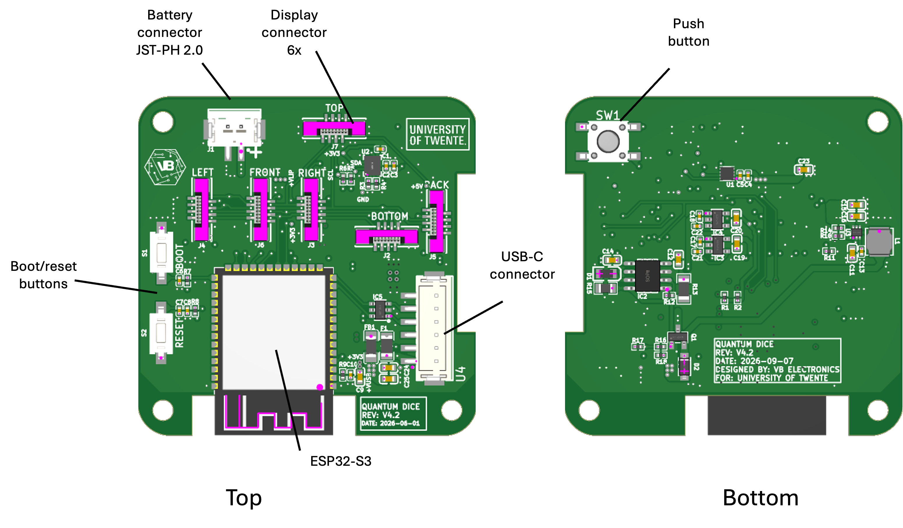

## 1. Introduction
This construction manual provides all the information required to build your own set of **Quantum Dice (Series 4)**. It covers component sourcing, 3D printing, preparation of the electronics, firmware installation, and step-by-step assembly.

The Quantum Dice were developed by the **University of Twente**. All designs are freely available under the **CC BY licence**.

For further information, visit [Quantum Dice by University of Twente](https://www.utwente.nl/en/mesaplus/education/quantum-dice/) or read the pre-print of our article on [arXiv](https://arxiv.org/abs/2510.04931).

This manual describes **Series 4** of the Quantum Dice. Information and design files for previous versions are available in the corresponding archive folders.

> **Note:** The University of Twente can provide ready-to-use PCBs. All other components, including the 3D-printed parts, displays, batteries, and cables, can either be sourced independently or, where available, obtained through the University of Twente.

## 2. General Description of the Quantum Dice

The **Quantum Dice** are designed to make abstract quantum-mechanical concepts such as **quantum superposition**, **entanglement**, and **quantum key distribution** more tangible.

The Quantum Dice are used in pairs and are identical in both hardware and software. When switched on together, the dice automatically connect and communicate with each other.

### 2.1 Main Components

Each Quantum Die consists of a **3D-printed Main Frame** with a **TFT display** on each of its six sides. The displays are mounted in coloured **Display Cups**.

The colour of each Display Cup indicates its orientation axis:

- **Front / Back**: x-axis, yellow
- **Left / Right**: y-axis, red
- **Top / Bottom**: z-axis, blue

Inside the die, a rechargeable **LiPo battery** supplies power to the electronics. The displays, communication, orientation sensing, and other functions are controlled by an **ESP32-S3 microcontroller** mounted on the PCB.

### 2.2 PCB

All electronics are integrated on a single double-sided **Printed Circuit Board (PCB)**.

The PCB includes:

- the **ESP32-S3 microcontroller**
- connectors for all six TFT displays
- an **Inertial Measurement Unit (IMU)** to detect the orientation and movement of the die
- a **push button**
- power and battery charging management
- a **USB-C connection** for firmware management and battery charging

The PCB controls the six displays, monitors and manages the power supply, detects the orientation and movement of the die, and provides the communication required for the Quantum Dice to operate.

The PCB is mounted on the yellow **Display Cup with flexible button tab**. The battery is mounted on the opposite yellow Display Cup.

More information about obtaining the PCB, either as a ready-to-use board from the **University of Twente** or by ordering and assembling it yourself, is provided in Section 3.2.

## 3. Parts and Sourcing

All parts required to construct the Quantum Dice are listed in the **Bill of Materials (BOM)**.

The BOM can be found here: [Bill of Materials](<Bill of Material quantum dice.xlsx>).

In the BOM, you can specify the number of Quantum Dice you wish to build. The required quantities of all components are then calculated automatically.

### 3.1 3D-Printed Parts

The required 3D-printed parts can either be **obtained from the University of Twente** or printed independently using the provided 3D-print files.

The current design is **Series 4**. Design files for previous versions are available in the corresponding archive folders.

All required STL files and additional information for 3D printing are included with the Quantum Dice design files. Detailed information about materials, print settings, and the individual components is provided in Chapter 4.

### 3.2 PCB

The **PCB** can either be obtained as a ready-to-use board from the **University of Twente** or ordered and assembled independently.

A PCB supplied by the University of Twente comes with the latest firmware installed and has been tested and calibrated. The required connection cables, screws, and other mounting hardware are also supplied with the board.

[Quantum Dice by University of Twente](https://www.utwente.nl/en/mesaplus/education/quantum-dice/)

If you have experience with PCB fabrication and microcontroller software, you can also order and assemble the PCB yourself using the provided production files.

- [PCB fabrication files](<../PCB files>)
- [Firmware source files](../firmware)
- [Firmware installation instructions](link)

> **Note:** If you order and assemble the PCB yourself, the firmware must be installed and the required configuration and calibration completed before the Quantum Die can be tested.

### 3.3 TFT Displays

Each Quantum Die requires **six TFT displays**. The recommended display type and links to suppliers are included in the **BOM**.

The displays require some preparation before they can be installed in the Display Cups. This is described in Chapter 6.

### 3.4 Battery

Each Quantum Die requires one rechargeable **3.7 V LiPo battery**. Links to suitable batteries are included in the BOM. Availability may vary, so equivalent batteries from other suppliers can also be used.

The battery should meet the following specifications:

- **Type:** 3.7 V LiPo
- **Capacity:** > 1000 mAh
- **Maximum height/width:** 50 mm
- **Maximum thickness:** 18 mm
- **Connector:** JST-PH, 2-pin, 2.0 mm pitch

LiPo battery dimensions are commonly indicated by a six-digit size code. For example, in **xx3048**, `xx` indicates the battery thickness, `30` indicates a width of 30 mm, and `48` indicates a height of 48 mm.

### 3.5 Cables and Other Components

The Quantum Die uses two main types of cables:

- **6 FPC cables** to connect the six TFT displays to the PCB
- **1 USB-C extension cable** to make the PCB's USB-C connection accessible from outside the Quantum Die for firmware management and battery charging

Additional cables and mounting components, including the battery cable, screws, and other fasteners, are listed in the BOM.

Use the BOM as the reference for the required quantities and specifications before starting the assembly.

## 4. 3D Printing

If you obtain the 3D-printed parts from the **University of Twente**, you can skip this chapter and continue with Chapter 5.

If you print the parts yourself, we recommend using **TPU for the Main Frame** and **PLA or PETG for the Display Cups and Backplanes**.

### 4.1 Recommended Materials

The **Main Frame** is printed in one piece and is designed to be made from flexible **TPU**. The flexibility of the frame helps protect the displays and electronics from impacts when the die is rolled.

A TPU hardness of **95A or 40D** is recommended.

The remaining components, including the **Display Cups** and **Backplanes**, can be printed in **PLA or PETG**.

It is also possible to print the Main Frame in PLA or PETG instead of TPU. However, these materials are rigid and provide less protection against impacts. If you use a rigid Main Frame, we recommend rolling the Quantum Dice on a **soft surface**, such as a yoga mat or foam pad.

### 4.2 Printing with TPU

Printing TPU requires some additional care:

1. **Dry the filament before printing** to reduce stringing and improve print quality.
2. **Use a reduced printing speed**, particularly when using fast printers such as the Prusa Core One or Bambu Lab models.
3. TPU should not be used with filament systems that require the flexible filament to be pushed over a long distance, such as the **Bambu Lab AMS** or **Prusa MMU3**. Feed the TPU directly into the print head instead.

Examples of suitable TPU filaments include:

- [Bambu Lab TPU 95A HF](https://eu.store.bambulab.com/products/tpu-95a-hf)
- [Fiberlogy Fiberflex-40D](https://www.3djake.nl/fiberlogy/fiberflex-40d)

For additional information about printing TPU:

- [Bambu Lab TPU Printing Guide](https://wiki.bambulab.com/en/knowledge-sharing/tpu-printing-guide)
- [How to Improve TPU Print Quality on Bambu Lab X1 Carbon](https://youtu.be/yN3RximKNiE?si=DYWy9xm7ewkI_fWw)

### 4.3 3D-Printed Components

For each Quantum Die, the following parts are required:

- 1 × black **Main Frame**
- 2 × red **Display Cups**
- 2 × blue **Display Cups**
- 1 × yellow **Display Cup with flexible button tab**
- 1 × yellow **Display Cup with USB-C port opening**
- 1 × yellow **PCB Display Backplane**
- 1 × yellow **Battery Display Backplane**

The two yellow Display Cups differ from the red and blue Display Cups. One yellow cup is used to mount the **PCB**, while the other is used to mount the **battery** and provide access to the **USB-C connector**.

Support is required for printing the Display Cups and the Main Frame.

### 4.4 Print Files

All 3D models are supplied in **STL format**. The filenames include the part name, recommended material, colour, and version number.

For convenience, **3MF build plates** containing the required parts are also provided. These files were prepared using **PrusaSlicer**, but can also be imported into **Bambu Studio**.

Depending on the printer and build plate size, some rearrangement of the parts may be required.

For additional information about the print files, orientation, and support settings, see the [3D print files README](README.md).

### 4.5 Outsourcing 3D Printing

If printing TPU yourself is not practical, the parts can be produced by a 3D-printing service.

Because the Main Frame is printed in flexible TPU and requires support, outsourcing the Main Frame can be a convenient option.

Several printing methods are available:

- **Fused Deposition Modelling (FDM):** generally lower cost
- **Selective Laser Sintering (SLS):** generally higher cost, with different surface and mechanical properties

A supplier we have used successfully is [JLC3D FDM Printing](https://jlc3dp.com/3d-printing/fused-deposition-modeling).

## 5. Preparing the 3D-Printed Parts

Before installing the electronics, prepare the 3D-printed parts as described below.

### 5.1 Required Tools
You will need:
- 2 mm and 2.5 mm hex keys
- cutting pliers
- **cyanoacrylate (CA) glue**, such as Loctite 406 for plastics
- tape

### 5.2 Gluing the PCB Display Backplane

The **PCB Display Backplane** must be glued to the yellow **Display Cup with flexible button tab** before the PCB can be mounted.

1. Apply a few drops of **CA glue** to the recessed edge of the Display Cup.
2. Carefully position the **PCB Display Backplane** on the Display Cup.
3. Press the Backplane firmly into place.
4. Allow the glue to cure before continuing.

> **Warning:** Use only a small amount of glue. Excess glue may overflow into the Display Cup or onto other surfaces.

---

## 6. Preparing the Electronics and Displays

Before assembling the Quantum Die, prepare the PCB and the six TFT displays as described below.

### 6.1 Required Parts and Tools

You will need:

- 1 × **PCB**
- 6 × **TFT displays**
- FPC cables
- USB-C charging cable
- battery cable
- M3 screws
- cutting pliers
- soldering iron

### 6.2 Soldering the Push Buttons

> **Skip this step if the PCB was supplied by the University of Twente.**

Solder the required **push buttons** onto the **PCB**.

Ensure that the push buttons are correctly positioned and that the solder joints are clean. Avoid overheating the PCB or components while soldering.

### 6.3 Removing the Original Display Connectors

Before mounting the TFT displays into the Display Cups, the original **grey plastic connectors and pins** must be removed from all six displays.

1. Use **cutting pliers** to make two cuts along the sides of the grey connector housing. This separates the plastic housing from the display board.
2. Grip the connector with pliers and gently rock it back and forth along its short side until the connector and pins detach from the display.
3. Remove the **protective foil stickers** covering the screw holes.

> **Note:** Some force may be required to remove the connectors. Work carefully to avoid damaging the display or other components on the display board.

### 6.4 Mounting the Displays into the Display Cups

Repeat the following procedure for all six displays:

1. Insert the display into the back of its **Display Cup**. Some pressure may be required.
2. If the display does not fit properly because of a slightly protruding edge, carefully remove a small amount of material from the Display Cup using fine sandpaper.
3. Secure the display using **countersunk M3×6 screws**. In most cases, **two screws per display are sufficient** to hold the display securely in place.

### 6.5 Mounting the USB-C Connector

Insert the **USB-C connector** firmly into the opening of the yellow **Display Cup with USB-C port opening**.

A small amount of pressure may be required to click the connector securely into place.

### 6.6 Installing the Firmware

If you are using a PCB supplied by the **University of Twente**, the firmware is already installed and the PCB has been tested and calibrated. You can skip this section.

If you ordered and assembled the PCB yourself, install the firmware before continuing with the final assembly. Complete any required configuration and calibration as described in the firmware instructions.

[Installing the Quantum Dice firmware](link)

> **Note:** The firmware must be installed before performing the display tests in Chapter 7.

---
## 7. Assembling the Quantum Die

With all 3D-printed and electronic components prepared, the Quantum Die can now be assembled.

### 7.1 Connecting FPC Cables

The displays are connected to the PCB using **FPC cables** (flat ribbon cables) with sliding-latch connectors. These connectors are delicate, so handle them carefully.

To connect an FPC cable:

1. **Unlock the connector** by gently pulling the sliding latch into the open position. Do not apply excessive force.
2. **Insert the FPC cable** straight into the connector until it reaches the mechanical stop.
3. **Lock the connector** by pushing the sliding latch back into the closed position while keeping the cable fully inserted.
4. **Check the connection** and make sure the cable is fully inserted and securely locked.

> **Important:** Pay attention to the orientation of the FPC cable. The **blue side of the cable must face away from the indentation of the FPC connector**.

### 7.2 Connecting the PCB Display Cup

The six display connectors on the PCB are labelled **TOP**, **BOTTOM**, **LEFT**, **RIGHT**, **FRONT**, and **BACK**.

Start with the yellow **Display Cup with flexible button tab**. This Display Cup holds the PCB and forms the **BACK** side of the die.

1. Insert the **short 60 mm FPC cable** into the display connector.
2. Connect the other end of the cable to the PCB connector labelled **BACK**.
3. Attach the **PCB** to the **PCB Display Backplane** using M3 hex screws.

### 7.3 Preparing the Battery Display Cup

Next, prepare the yellow **Display Cup with USB-C port opening**. This Display Cup holds the battery and forms the **FRONT** side of the die.

1. Insert the **long FPC cable** into the display connector.
2. Apply **double-sided foam tape** to the side of the **Battery Display Backplane** marked **BATTERY**.
3. Mount the **battery** onto the double-sided foam tape.
4. Attach the **Battery Display Backplane**, with the battery mounted, to the Display Cup using M3 hex screws.
5. Place the completed yellow Display Cup into the **Main Frame**.

>The Main Frame itself does not have a predefined orientation. Use the **arrow on the inside of the yellow Display Cup** to establish the orientation of the die. From this point onwards, the direction indicated by the arrow defines the **TOP** of the die and serves as the reference for the remaining assembly.

### 7.4 Connecting the Remaining FPC Cables

With the FRONT and BACK displays prepared, connect the remaining FPC cables to the PCB.

1. Unlock the remaining five FPC connectors on the PCB.
2. Insert four **medium-length FPC cables** into the connectors labelled **TOP**, **BOTTOM**, **LEFT**, and **RIGHT**.
3. Connect the long FPC cable from the yellow FRONT Display Cup to the connector labelled **FRONT**.

Make sure all FPC cables are fully inserted and securely locked.

### 7.5 Mounting the PCB Display Cup into the Main Frame

1. Connect the **battery cable** to the PCB.
2. Connect the **six-wire power cable** to the PCB.
3. You may need to hold the PCB and its Display Cup close to the Main Frame while connecting the cables, as the cables are relatively short.
4. Insert the yellow **PCB Display Cup** into the Main Frame on the side opposite the yellow Battery Display Cup.
5. Make sure the **arrows on the inside of both yellow Display Cups point upwards**.
6. Guide the remaining FPC cables through their corresponding openings in the Main Frame:
   - **LEFT** and **RIGHT** through the openings on the sides
   - **TOP** through the opening at the top
   - **BOTTOM** through the opening at the bottom

> **Warning:** Avoid pulling, sharply bending, or pinching the FPC cables during assembly.

### 7.6 Mounting the Red Display Cups

Mount the **LEFT** and **RIGHT** red Display Cups.

1. Insert the **LEFT** FPC cable into the display in the corresponding red Display Cup and close the FPC connector latch.
2. Repeat this procedure for the **RIGHT** Display Cup.
3. Make sure the FPC cables are oriented so that they do not need to twist when the Display Cups are inserted.
4. Insert both red Display Cups into the **Main Frame**.

> **Warning:** An FPC cable can become trapped between a Display Cup and the Main Frame when the cup is pressed into place. Gently guide the cables into the central cavity of the die while inserting the Display Cups. Avoid pinching, sharply bending, or placing excessive stress on the cables.

### 7.7 Initial Display Test

Before mounting the blue Display Cups, test the four displays that are currently connected.

1. Switch on the Quantum Die by pressing the **push button** through the flexible button tab in the yellow Display Cup.
2. Check that all connected displays show the **startup sequence**.

If one or more displays remain blank, switch off the Quantum Die and check the corresponding FPC cable and connector before continuing.

> **Note:** This test requires the firmware to be installed on the PCB. See Section 6.6.

### 7.8 Mounting the Blue Display Cups

Finally, mount the **BOTTOM** and **TOP** blue Display Cups.

1. Insert the **BOTTOM** FPC cable into the display in one of the blue Display Cups and close the FPC connector latch.
2. Make sure the cable does not need to twist when the Display Cup is inserted.
3. Insert the bottom blue Display Cup into the **Main Frame**.
4. Insert the **TOP** FPC cable into the display in the remaining blue Display Cup and close the FPC connector latch.
5. Make sure the cable does not need to twist when the Display Cup is inserted.
6. Insert the top blue Display Cup into the **Main Frame**.

> **Warning:** The FPC cables can become trapped between the Display Cups and the Main Frame. Gently guide the cables into the central cavity while inserting the Display Cups.

## 8. Final Test and Completion

The Quantum Die is now fully assembled.

1. Switch on the Quantum Die.
2. Check that **all six displays** show the startup sequence.
3. Verify that the **battery voltage** is displayed correctly.
4. Check that none of the Display Cups or FPC cables are loose or under tension.

If one or more displays remain blank, switch off the Quantum Die and check the corresponding FPC cable and connector.

If you are using a PCB supplied by the **University of Twente**, the firmware, configuration, and calibration have already been completed. If you assembled the PCB yourself, make sure that all required firmware installation, configuration, and calibration steps have been completed.

## Congratulations!

You have successfully built a **Quantum Die**.

When two Quantum Dice are switched on, they automatically connect and communicate with each other. Your Quantum Dice are now ready for use.

For instructions on how to use the Quantum Dice and the available demonstrations, see [Using the Quantum Dice](link).

