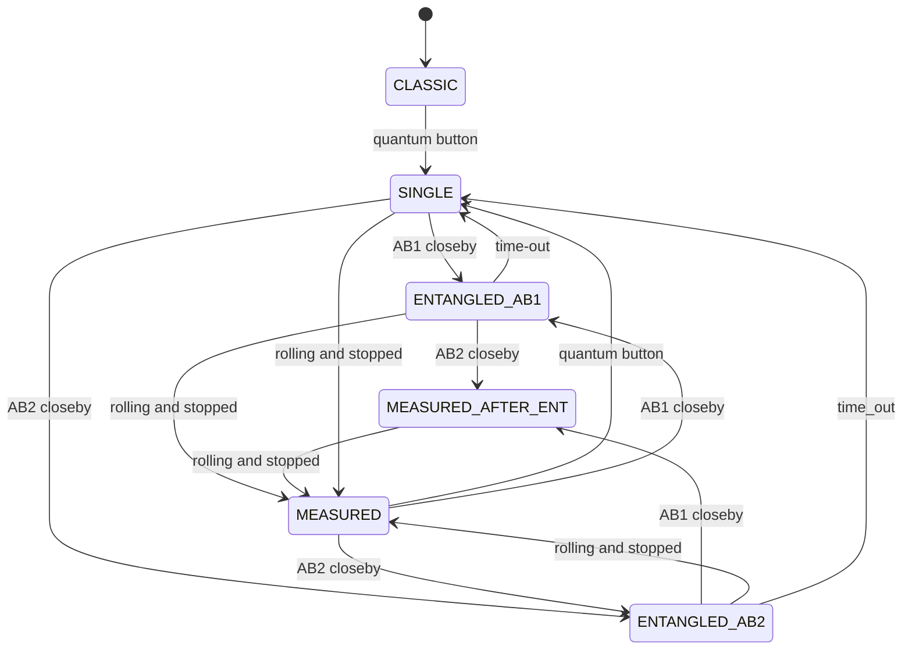

```mermaid

stateDiagram-v2
CLASSIC --> SINGLE :quantum button
SINGLE --> ENTANGLED_AB1 :AB1 closeby
SINGLE --> ENTANGLED_AB2 :AB2 closeby
ENTANGLED_AB1 --> MEASURED_AFTER_ENT :AB2 closeby
ENTANGLED_AB2 --> MEASURED_AFTER_ENT :AB1 closeby
ENTANGLED_AB1 --> MEASURED :rolling and stopped
ENTANGLED_AB2 --> MEASURED :rolling and stopped
ENTANGLED_AB1 --> SINGLE :time-out
ENTANGLED_AB2 --> SINGLE :time_out
MEASURED_AFTER_ENT --> MEASURED :rolling and stopped
SINGLE --> MEASURED :rolling and stopped
MEASURED --> SINGLE :quantum button
MEASURED --> ENTANGLED_AB1 :AB1 closeby
MEASURED --> ENTANGLED_AB2 :AB2 closeby
[*] --> CLASSIC


```
