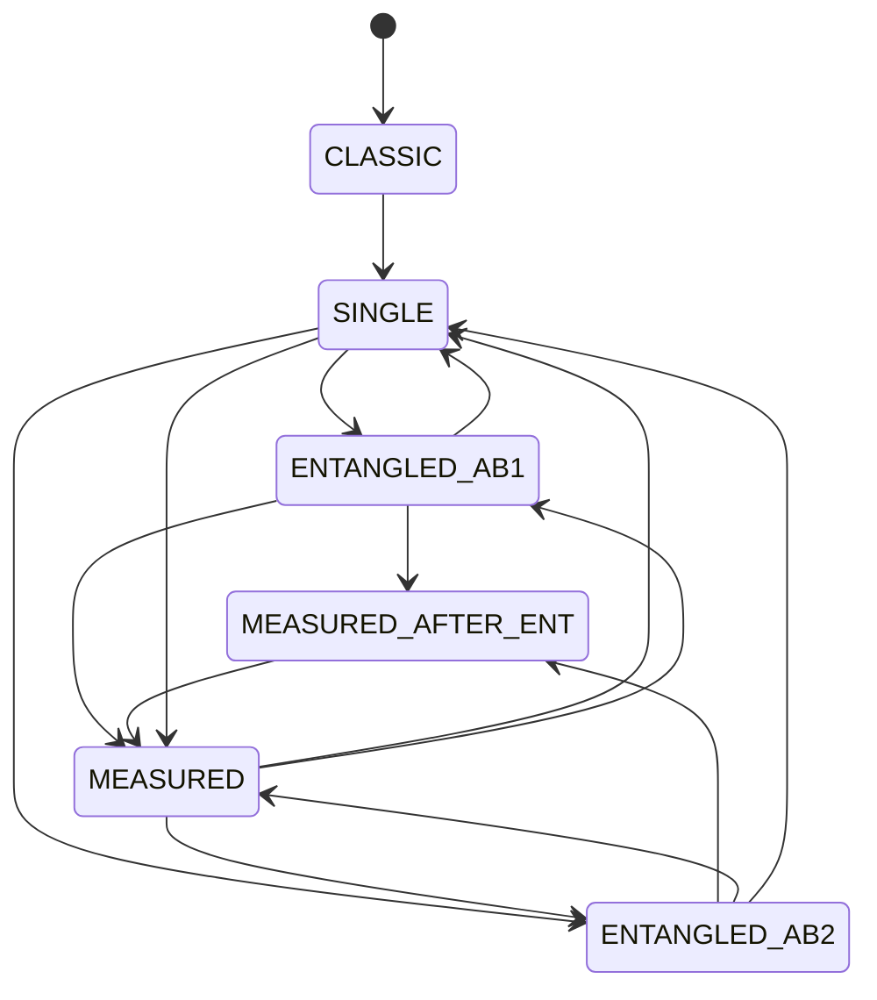

```mermaid

stateDiagram-v2
CLASSIC --> SINGLE
SINGLE --> ENTANGLED_AB1
SINGLE --> ENTANGLED_AB2
ENTANGLED_AB1 --> MEASURED_AFTER_ENT
ENTANGLED_AB2 --> MEASURED_AFTER_ENT
ENTANGLED_AB1 --> MEASURED
ENTANGLED_AB2 --> MEASURED
ENTANGLED_AB1 --> SINGLE
ENTANGLED_AB2 --> SINGLE
MEASURED_AFTER_ENT --> MEASURED
SINGLE --> MEASURED
MEASURED --> SINGLE
MEASURED --> ENTANGLED_AB1
MEASURED --> ENTANGLED_AB2
[*] --> CLASSIC

```
