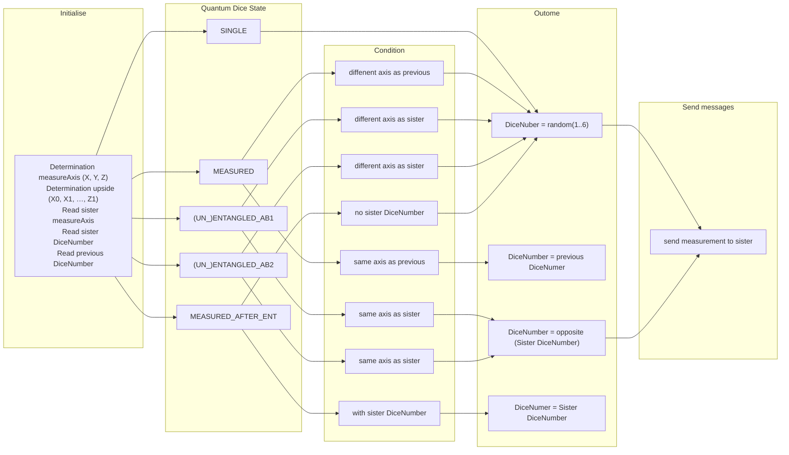

# Function for determining the upward-facing number on the dice display #

Starting conditions: the dice is in state INITMEASURED (in which the dice becomes in dice state MEASURED) after rolling the dice.

Input are:

- the measureAxis (X, Y or Z)
- the upside of the dice (X0, X1, …, Z1)
- the DiceNumber of the upward-facing side of the previous rolling
- the measureAxis and diceNumber as send by the sister dice to the dice
- current diceState (SINGLE, MEASURED, (UN_)ENTANGLED_AB1, (UN_)ENTANGLED_AB2, MEASURED_AFTER_ENT)
- 

Output:
- the numbers to display on the upward-facing and downward-facing display
- messages to sister dice of  measureAxis and diceNumber
- diceState  is MEASURED

