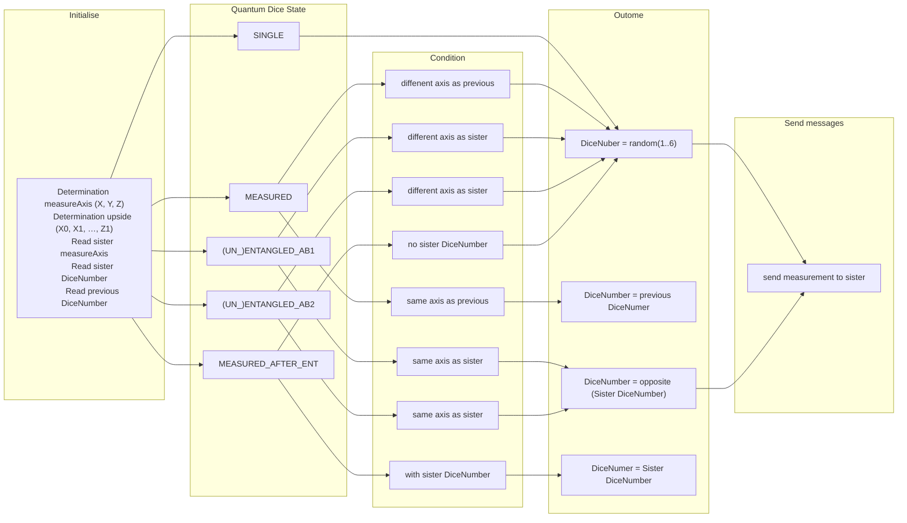

# Flow chart determination dice number on top laying display #

```mermaid

flowchart LR
    subgraph Initialise
        A["Determination measureAxis (X, Y, Z)
        Determination upside (X0, X1, …, Z1)
        Read sister measureAxis
        Read sister DiceNumber
        Read previous DiceNumber"]
    end

    subgraph Quantum Dice State
        B["SINGLE"]
        C["MEASURED"]
        D["(UN_)ENTANGLED_AB1"]
        E["(UN_)ENTANGLED_AB2"]
        F["MEASURED_AFTER_ENT"]
    end

        subgraph Condition
G["same axis as previous"]
H["diffenent axis as previous"]
I["same axis as sister"]
J["different axis as sister"]
K["same axis as sister"]
L["different axis as sister"]
M["no sister DiceNumber"]
N["with sister DiceNumber"]
    end
        subgraph Outome
        O["DiceNuber = random(1..6)"]
P["DiceNumber = previous DiceNumer"]
Q["DiceNumber = opposite (Sister DiceNumber)"]
R["DiceNumer = Sister DiceNumber"]
    end
    subgraph Send messages
    S["send measurement to sister"]
    end


    A --> B
    A --> C
    A --> D
    A --> E
    A --> F 
    C --> G
    C --> H
    D --> I 
    D --> J
    E --> K
    E --> L
    F --> M 
    F --> N 
    B --> O
    G --> P
H --> O
I --> Q
J --> O
K --> Q
L --> O
M --> O
N --> R
O --> S 
Q --> S 


```
