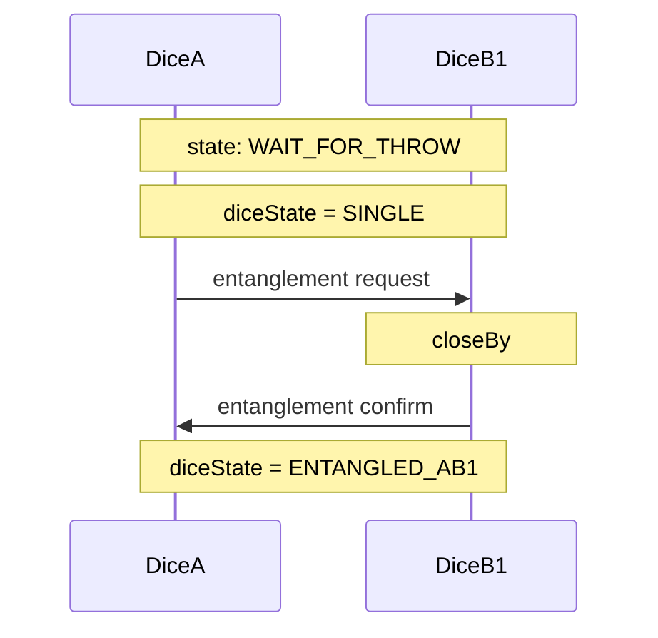
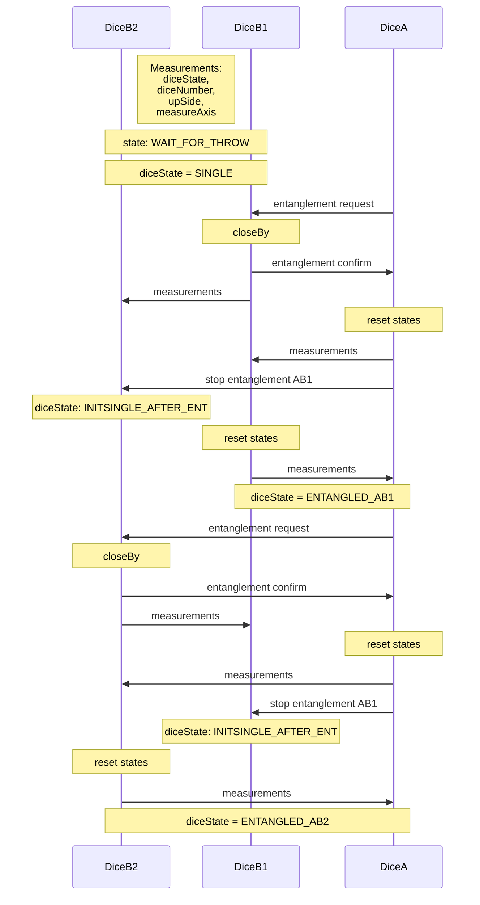

# Entanglement sequence #

## Entanglement sequence double dice ##

```mermaid
sequenceDiagram
    participant DiceA
    participant DiceB1
    Note over DiceA,DiceB1: state: WAIT_FOR_THROW
    Note over DiceA,DiceB1: diceState = SINGLE
    DiceA->>DiceB1: entanglement request
    Note over DiceB1: closeBy
    DiceB1->>DiceA: entanglement confirm
    Note over DiceA,DiceB1: diceState = ENTANGLED_AB1
```

## Entanglement sequence triple dice (Teleportation) ##

```mermaid
sequenceDiagram
    Note right of DiceB2: Measurements:<br/> diceState,<br/>diceNumber,<br/>upSide,<br/>measureAxis
    participant DiceB1
    participant DiceA
    participant DiceB2
    Note over DiceB1,DiceB2: state: WAIT_FOR_THROW
    Note over DiceB1,DiceB2: diceState = SINGLE

    DiceA->>DiceB1: entanglement request
    Note over DiceB1: closeBy
    DiceB1->>DiceA: entanglement confirm
    DiceB1->>DiceB2: measurements
    Note over DiceA: reset states
    DiceA->>DiceB1: measurements
    DiceA->>DiceB2: stop entanglement AB1
    Note over DiceB2: diceState: INITSINGLE_AFTER_ENT
    Note over DiceB1: reset states
    DiceB1->>DiceA: measurements
    Note over DiceA,DiceB1: diceState = ENTANGLED_AB1


    DiceA->>DiceB2: entanglement request
    Note over DiceB2: closeBy
    DiceB2->>DiceA: entanglement confirm
    DiceB2->>DiceB1: measurements
    Note over DiceA: reset states
    DiceA->>DiceB2: measurements
    DiceA->>DiceB1: stop entanglement AB1
    Note over DiceB1: diceState: INITSINGLE_AFTER_ENT
    Note over DiceB2: reset states
    DiceB2->>DiceA: measurements
    Note over DiceA,DiceB2: diceState = ENTANGLED_AB2

```
