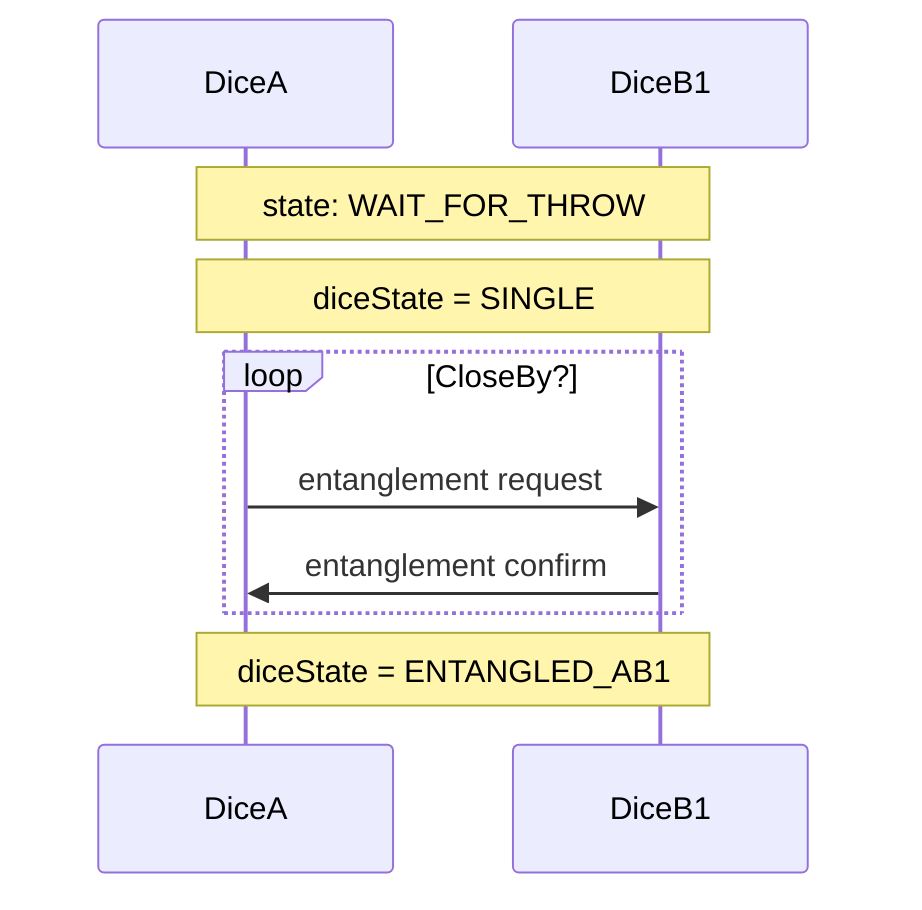
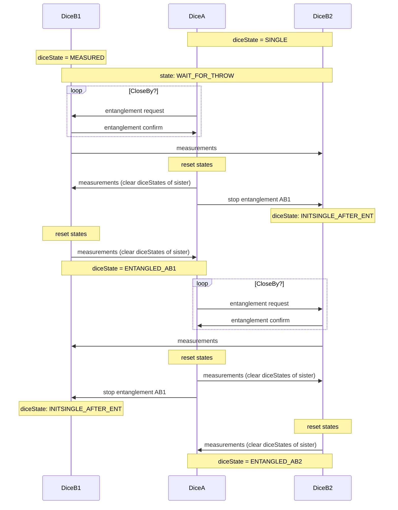

# Entanglement sequence #

## Entanglement sequence double dice (simplified) ##

```mermaid
sequenceDiagram
    participant DiceA
    participant DiceB1
    Note over DiceA,DiceB1: state: WAIT_FOR_THROW
    Note over DiceA,DiceB1: diceState = SINGLE
    loop CloseBy?
        DiceA->>DiceB1: entanglement request
        DiceB1->>DiceA: entanglement confirm
    end
    Note over DiceA,DiceB1: diceState = ENTANGLED_AB1
```

## Entanglement sequence triple dice (Teleportation) ##

```mermaid
sequenceDiagram

    participant DiceB1
    participant DiceA
    participant DiceB2

    Note over DiceA,DiceB2: diceState = SINGLE
    Note over DiceB1: diceState = MEASURED
    Note over DiceB1,DiceB2: state: WAIT_FOR_THROW
    loop CloseBy?
        DiceA->>DiceB1: entanglement request
        DiceB1->>DiceA: entanglement confirm
    end
    DiceB1->>DiceB2: measurements
    Note over DiceA: reset states
    DiceA->>DiceB1: measurements (clear diceStates of sister)
    DiceA->>DiceB2: stop entanglement AB1
    Note over DiceB2: diceState: INITSINGLE_AFTER_ENT
    Note over DiceB1: reset states
    DiceB1->>DiceA: measurements (clear diceStates of sister)
    Note over DiceA,DiceB1: diceState = ENTANGLED_AB1

    loop CloseBy?
        DiceA->>DiceB2: entanglement request
        DiceB2->>DiceA: entanglement confirm
    end
    DiceB2->>DiceB1: measurements
    Note over DiceA: reset states
    DiceA->>DiceB2: measurements (clear diceStates of sister)
    DiceA->>DiceB1: stop entanglement AB1
    Note over DiceB1: diceState: INITSINGLE_AFTER_ENT
    Note over DiceB2: reset states
    DiceB2->>DiceA: measurements (clear diceStates of sister)
    Note over DiceA,DiceB2: diceState = ENTANGLED_AB2

```
