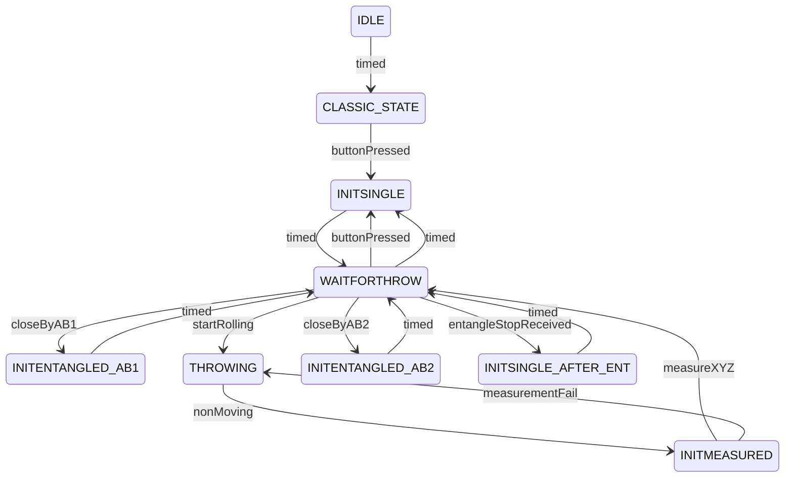

```mermaid
stateDiagram-v2
IDLE-->CLASSIC_STATE: timed
CLASSIC_STATE-->INITSINGLE: buttonPressed
INITSINGLE-->WAITFORTHROW: timed


INITENTANGLED_AB1-->WAITFORTHROW: timed
WAITFORTHROW-->INITSINGLE: buttonPressed
WAITFORTHROW-->INITENTANGLED_AB1: closeByAB1
WAITFORTHROW-->THROWING: startRolling

WAITFORTHROW-->INITSINGLE: timed
THROWING-->INITMEASURED: nonMoving

INITMEASURED-->WAITFORTHROW: measureXYZ
INITMEASURED-->THROWING: measurementFail


INITENTANGLED_AB2-->WAITFORTHROW: timed
WAITFORTHROW-->INITENTANGLED_AB2: closeByAB2

INITSINGLE_AFTER_ENT-->WAITFORTHROW: timed
WAITFORTHROW-->INITSINGLE_AFTER_ENT: entangleStopReceived

```


[*] --> IDLE
```
