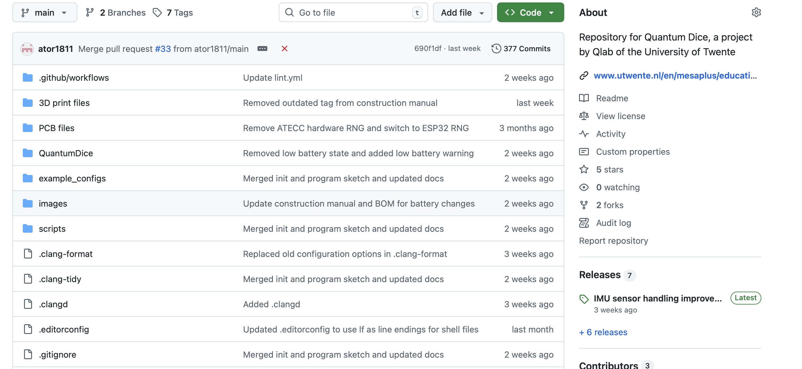
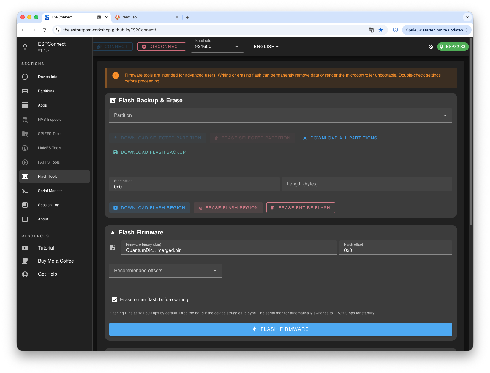

# 🎲 Quantum Dice Software Migration Guide from V1.x.x. to V2.0.0

**Welcome!** This guide will walk you through updating the Quantum Dice from version 1.0.x to version 2.0.0 firmware step-by-step. Don't worry if you're not technical – we've designed this guide to be easy to follow. Just take it one step at a time, and you'll have your Quantum Dice up and running in no time!

---

## 📑 Table of Contents

1. [Why this update?](#why-this-update)
2. [What You'll Need](#what-youll-need-for-the-update)
3. [Understanding the Setup Process](#understanding-the-setup-process)
4. [Getting Started](#getting-started)
   - [Downloading the Firmware Files](#step-1-download-the-firmware-files)
5. [Installing the Main Program](#installing-the-main-program)
   - [Flashing the Quantum Dice Firmware](#step-2-flash-the-quantum-dice-firmware-to-both-dice)
   - [Preparing Your Configuration File](#step-3-prepare-your-configuration-file)
   - [Uploading Your Configuration File](#step-4-upload-your-configuration-file)
   - [Verifying Everything Works](#step-5-verify-everything-works)
6. [Troubleshooting](#troubleshooting)
7. [Need More Help?](#need-more-help)

---

## Why this update?

We are continously improving the Quantum Dice software both technical and functional. The latest release V2.0.0 is a major upgrade. Before this release a set of 2 Quantum dice were paired, meaning only a pair is able to entangle. In version 2.0.0 this is no longer the case. Any two dice in each others neigbourhood can entangle when the entanglement criteria are met. Next to that it is possible to demonstrate the Teleportation protocol. On how to do this see our Quantum Dice User Manual.

The configuration file has also changed with some new options. See an [example configuration file](https://github.com/qlab-utwente/Quantum-Dice-by-UTwente/tree/main/example_configs) for more details.

## What You'll Need for the update

Before you begin, gather these items:

### Required Items

- ✅ **Your Quantum Dice** with upper and lower displays removed
- ✅ **Computer** with internet access
- ✅ **USB-C cable** that supports data transfer (not just charging)
- ✅ **Web browser**: Chrome, Edge, or Opera (Safari and Firefox won't work)

### About Your Dice

- The USB-C connector is located on the **bottom side** of each dice
- You'll need to connect each dice **separately** during setup
- Remove the 4 wire powercable on the **upper side** of the dice before connecting the USB-C cable.

### Open Software flashing tool

- Use with Chrome, Edge, or Opera (Safari and Firefox won't work)
- go to [ESPConnect](https://thelastoutpostworkshop.github.io/ESPConnect/) - this is a generic ESP32 maintenance and software flashing tool.


---

## Understanding the Setup Process

**Don't worry – this might look like a lot, but it's simpler than it seems!**

Here's what we'll do in plain English:

1. **Download files** – Get the software files from the internet
2. **Install the main program** - Load the Quantum Dice software
3. **Upload configuration** - Put your settings on the dice
4. **Test** - Make sure everything works!

The firmware updates wil take approximitely 5 minutes per dice!

---

## Getting Started

### Step 1: Download the Firmware Files

**What you're doing:** Getting the software programs that run your Quantum Dice.

1. **Open your web browser** and go to:  
   [https://github.com/qlab-utwente/Quantum-Dice-by-UTwente/releases/](https://github.com/qlab-utwente/Quantum-Dice-by-UTwente/releases)

2. **Look for the latest release** at the top of the page (it will have a version number like v2.0.0)



1. **Download the files:**
   - `QuantumDice.vX.X.X.merged.bin` – (X.X.X will be version numbers)
   - (`QuantumDice.vX.X.X.merged.bin` is not needed now)

✅ **You're done with Step 1!**

---

## Installing the Main Program

### Step 2: Flash the Quantum Dice Firmware to Both Dice

**What you're doing:** Installing the main Quantum Dice program the dice.

**With your dice connected:**

1. **Open [ESPConnect](https://thelastoutpostworkshop.github.io/ESPConnect/)** with Chrome, Edge, or Opera (Safari and Firefox won't work)

2. **In ESPConnect, click Connect, select the COM-port of the ESP32**


1. **In ESPConnect, click "Flash Tools"** in the left sidebar

2. **Scroll to the "Flash Firmware" section**


1. **Click "Firmware binary (.bin)" button**



1. **Select the file** `QuantumDice.vX.X.X.merged.bin` (from Step 1)

2. **Select Flash Offset on 0x0**

3. **Check "Erase entire flash before writing"**

4. **Click "⚡ Flash firmware"** and confirm

5. **Wait** for the upload to complete (about 30 seconds to 1 minute)

6. **Success!** You should see "Flash complete"

7. **Repeat for all your dice:**
    - Disconnect the current dice
    - Connect the next dice
    - Follow the same steps (steps 1-7 above)

✅ **Quantum Dice firmware is now installed on all dice!**

---

### Step 3: Prepare Your Configuration File

**What you're doing:** Creating a file that tells your dice how to behave.

1. **Download the example configuration file:**  
   [TEST1_config.txt](TEST1_config.txt) *(right-click and "Save Link As...")*

2. **Open the file** your text editor

3. **Read the instructions** inside the file – they explain what each setting does

4. **Search for `diceId=TEST1` and change this to you own diceID** – the diceID appears on the display during startup. Your're free to choose any character

5. **Adjust the other settings if needed** (colors, timeouts, etc.) – the default values work well for most users

6. **Save the file** with your new name:
   - Save it as `YOURNAME_config.txt`

✅ **You're done with Step 3!**

### Step 4: Upload Your Configuration File

**What you're doing:** Putting your configuration settings onto your dice.

**Make sure your dice is still connected.**

1. **In ESPConnect, click "LittleFS Tools"** in the left sidebar

2. **Click "Download Backup"** button
   - This is a safety step required before uploading
   - Even if there's nothing to back up, click it anyway
   - Wait for it to complete

3. **After the backup completes**, the "Upload File" section will become available

4. **Click "Choose File"**

5. **Select your configuration file** (e.g., `YOURNAME_config.txt`)

6. **Click "Upload"** – the file uploads to your browser only (not to the dice yet!)

7. **Click "SAVE TO FLASH"** button

8. **Confirm** when asked (click "OK" or "Yes")

9. **Wait** for the upload to complete

10. **Verify the upload:**
    - Look for the eye icon next to your file
    - Click it to view the contents
    - Make sure it matches your configuration file

✅ **Configuration uploaded your dice!**

---

### Step 5: Verify Everything Works

**What you're doing:** Making sure your dice are working correctly.

#### Method 1: Visual Test (If Displays Are Connected)

1. **Watch for the startup sequence:**
   - You should see logos and animations
   - The dice should display properly

✅ **If you see the startup sequence, your dice are working!**

#### Method 2: Serial Monitor Test

**This method works even without displays attached.**

1. **Connect a dice to your computer**

2. **In ESPConnect, click "Serial Monitor"** in the left sidebar

3. **Click "Start"** button

4. **Watch the text output** – you should see something like:

```text
   [LOG] 
   [LOG] ╔════════════════════════════════════════╗
   [LOG] ║      QUANTUM DICE INITIALIZATION       ║
   [LOG] ╚════════════════════════════════════════╝

   [LOG] /home/twan/Development/Quantum-Dice-by-UTwente/QuantumDice/QuantumDice.ino Jan 26 2026 21:09:54
   [L] FW: 2.0.0
   [LOG] Step 1: Initializing filesystem and configuration...
   [LOG] 
   [DEBUG] Mounting LittleFS...
   [DEBUG] LittleFS mounted successfully
   [D] Total: 4194304 bytes, Used: 8192 bytes
   [D] Found config file: YOURNAME_config.txt
   ...
```

1. **What to look for:**
   - ✅ "Config loaded successfully"
   - ✅ "LittleFS mounted successfully"
   - ✅ "ESP-NOW initialized successfully"
   - ✅ Your dice ID appears correctly
   - ⚠️ You might see some I2C error messages – these are usually okay if sensors initialize afterward

✅ **If you see "Setup complete!" you're all done!**

---

## Troubleshooting

### "WebSerial API is not supported"

**What this means:** Your browser doesn't support the tool we need.

**Solutions:**

- ✅ Switch to Chrome, Edge, or Opera browser
- ✅ Update your browser to the latest version
- ❌ Safari and Firefox don't work – you must use Chrome, Edge, or Opera

---

### "Cannot connect to serial port" or "Port is not available"

**What this means:** Something is blocking access to your dice.

**Solutions:**

- ✅ Close Arduino IDE, PuTTY, or any other program that might be using the port
- ✅ Disconnect and reconnect your USB cable
- ✅ Try a different USB port on your computer
- ✅ Try a different USB-C cable (some cables are charge-only)
- ✅ Restart your computer if the problem persists

**To check if your computer sees the device:**

- **Windows:** Open Device Manager → look under "Ports (COM & LPT)"
- **Mac:** Open Terminal → type `ls /dev/tty.*` and press Enter
- **Linux:** Open Terminal → type `ls /dev/tty*` and press Enter

---

### "Flash failed" or "Upload failed"

**Solutions:**

- ✅ Check your USB cable – make sure it supports data transfer
- ✅ Try holding the BOOT button on your dice while clicking "Flash firmware"
- ✅ Make sure Flash Offset is set correctly:
  - `0x0` for initial upload with the `vX.X.X.merged.bin` file
  - `0x10000` for software updates with the `vX.X.X.bin` file
- ✅ Try a different USB port
- ✅ Make sure no other program is using the serial port

---

### Configuration File Not Loading

**Signs:** Serial monitor shows "No config file found" and creates and uses `DEFAULT_config.txt`.

**Solutions:**

- ✅ Make sure your filename matches the pattern: `XXXXX_config.txt` (5 letters before _config.txt)
- ✅ Check that Flash Offset was `0x10000` when you flashed the main firmware
- ✅ Try uploading the config file again ([Step 4](#step-4-optional-upload-your-configuration-file))
- ✅ Use the eye icon in LittleFS Tools to verify the file is actually on the dice

---

### Dice Show Errors on Serial Monitor

**I2C Errors:**

```
E (3535) i2c.master: I2C transaction unexpected nack detected
```

These are usually **normal** if you see "BNO055 initialization complete!" afterward. The sensors are just taking a moment to respond.

**Real Problems to Watch For:**

- ❌ "LittleFS mount failed" – means storage wasn't set up properly, try flashing the firmware again with the merged.bin file
- ❌ "Config load failed" – means your config file has errors or wasn't uploaded
- ❌ Setup never completes – check all previous steps

---

## Need More Help?

If you're stuck:

1. **Double-check you followed each step** – it's easy to miss something small!

2. **Look at the serial monitor output** – it often tells you exactly what's wrong

3. **Try the process on the other dice** – sometimes one dice has an issue but the other works fine

4. **Reach out for support:**
   - Check the GitHub repository for updates: [https://github.com/qlab-utwente/Quantum-Dice-by-UTwente](https://github.com/qlab-utwente/Quantum-Dice-by-UTwente)
   - Create an issue on GitHub with:
     - What step you're on
     - What error message you see
     - What you've already tried

---

## 🎉 Congratulations

You've successfully set up your Quantum Dice! The hard part is done. From now on, updates are quick and easy.

**Enjoy your Quantum Dice!** 🎲

---

*Document Version 1.1 – Last Updated: February 2026*
