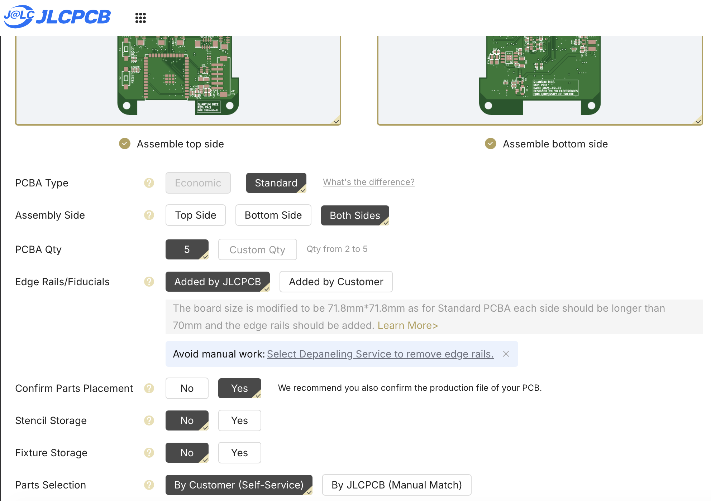

# Power Board and Processor Board Information

In this directory you find the files needed to order your Printed Circuit Boards (PCB) for the ESP32 ProcessorPCB.

Since version 4 of the PCB all electronics are assembled on a double sided single PCB. The related 3D printfiles are version 3.x.

Per board the following files are available:

- Gerber files in ZIP format
- Bill of Material (BOM) list
- Pick and place file

---

## PCB Fabrication

The Gerber files can be used to fabricate the PCBs. This can be done by [JLCPCB.com](https://www.jlcpcb.com) or [PCBway.com](https://www.pcbway.com) or equivalent.

Important to notice is that the ProcessorPCB is a 6-layer board

---

## Assembly of Boards

In the BOM file the required components are listed. The numbers refer to JLCPCB Part Numbers. This number can be used to order parts from JLCPCB.

JLCPCB offers a service to assemble the PCB after PCB fabrication called **PCB Assembly**.

After uploading the Gerber files in JLCPCB (default settings are OK), select PCB Assembly.

- Select *Assemble both side*
- Select *Standard*
- Select *Confirm Parts Placement* (From my own experience JLCPCB can make mistakes with the orientation of components. With this option you will be asked to verify component orientation)

Next upload BOM and Pick and Place file.

The correct orientation is indicated in Magenta

## Final Notes

After assembly, carefully inspect both boards for:

- Correct component orientation
- Proper soldering quality
- No bridged connections

Once you receive your assembled PCBs, verify all components against the BOM before powering up the boards for the first time.

For questions or issues during the ordering process, refer to the manufacturer's documentation or contact their support team.

---

**Next steps**
Connect the battery, the USB-cable and the displays on the board and upload the firmware (see construction manual).

---

**Good luck with your PCB fabrication and assembly!**
